# Web Development Bootcamp 2022 Notes

## HTML

### HTML: Essentials

```html
<b></b>
```

> Bring attention to element.

---

```html
<p></p>
```

> Paragraph

---

```html
<h1></h1>
<h2></h2>
<h3></h3>
```

> - advisable to have only one h1 in a page
> - never have a h3 without h2 or h1.

---

```html
<ul>
  <li></li>
  <li></li>
  <li></li>
  <li></li>
</ul>
```

> Unordered list

---

```html
<ol>
  <li></li>
  <li></li>
  <li></li>
  <li></li>
</ol>
```

> Ordered List

> - `<ul>` and `<ol>` are supposed to have `<li>` nested under them but `<li>` can have all other elements nested under it.

---

```html
<a href="https://www.google.com">some text</a>
<a href="about.html">some text</a>
<a href="mailto:m.bluth@email.com">some text</a>
<a href="tel:+91857384758">some text</a>
```

> **Anchor tag:** creates a hyperlink to webpages, files, email addresses, locations in same page.

---

```html

```

> **Image element** with its common attributes

---

```html
<!-- this is a comment section -->
```

> HTML comments

---

```html
<div></div>
<div class=""></div>
```

> - The Content Division element
> - generic container to hold things or group things together
> - _**block level**_ element

---

```html
<span></span> <span class=""></span>
```

> - container element

> - _**inline**_ element

---

```html
<hr />
```

> horizontal line - represents a thematic break betweek paragraph level elements

---

```html
<br />
```

> line break

---

```html
<sup></sup>
```

> superscript

---

```html
<sub></sub>
```

> subscript

---

### HTML Boilerplate

```html
<!DOCTYPE html>
<html>
  <head>
    <title></title>
  </head>
  <body></body>
</html>
```

> - `<html>` is the root (top-level) element.
> - all other elements must be descentants of `<html>`
> - `<head>` contains metadata
> - `<title>` document's title which appears on the tab of the browser and google uses `<title>` element to list it on the results.

---

### HTML Entities

```html
&#169
```

> - Start with an ampersand and end with a semicolon
> - Used to display reserved characters, that normally would be invalid.
> - Also used in place of difficult to type characters
> - the browser interprets them and renders the correct character instead.
> - Entities list with their codes [link1](https://dev.w3.org/html5/html-author/charref) and [link2](https://entitycode.com/)

---

### Semantic Markup

> - Search engines will consider its contents as important keywords to influence the page's SEO.
> - Accessibility: for screen readers.
> - makes it easy for developers

```html
<section></section>

<nav></nav>

<header></header>

<footer></footer>

<summary></summary>

<details></details>

<time datetime="2018-7-07">July 7</time>

<figure>
  
  <figcaption>The moon</figcaption>
</figure>
```

```html
<article></article>
```

> - Represents a self-contained composition in a document, page, application, or site, which is intended to be independently distributable or reusable

```html
<main></main>
```

> - `<main>` is the dominant content of the `<body>` of the document.
> - Content that is repeated across a set of documents like sidebars, nav links, copyright, site logos and search forms _**should'nt**_ be included in the `<main>` element.
> - `<main>` does'nt affect the DOM,s concept of the structure of the page.

```html
<aside></aside>
```

> - represents a portion of a document whose content is only indirectly related to the document's main content Asides are frequently presented as sidebars or call-out boxes.

---

### HTML: Tables

```html
<table></table>

<td></td>
- table data cell element: a single cell that contains data

<tr></tr>
- defines a row of cells in a table

<thead></thead>

<tbody></tbody>

<tfoot></tfoot>

<colgroup></colgroup>

<caption></caption>
```

```html
<th></th>
<th scope="col" rowspan="2"></th>
<th scope="col" colspan="2"></th>
```

> - defines a cell as header of a group of cells.
> - The nature of this group is defined by the scope and headers attributes.

---

### HTML: Forms

```html
<form action="server url"></form>
```

> - Represents a document section containing interactive controls for submiting information
> - The `action` attribute specifies WHERE the form data should be sent.
> - The `method` attribute specifies which HTTP method should be used.

---

```html
<input type="text" placeholder="username" name="" id="" />
```

> - used to create a variety of different form controls
> - 20+ possible types of input available
> - type attribute dramatically alters the input's behavior and appearance.
> - only one element on a page should have the given ID.
> - the `name` attribute should match what the server expects to be sent. if the server looks for `search?q` name of this input in this form should be `q`.

---

```html
<input type="checkbox" id="chkyes" name="yes" checked />
```

> `checked` keeps the checkbox checked by default.

---

```html
<label for="some id">Do you like cheese?</label>
```

> - A lable text is both visually and programmatically associated with its text input.
> - a screenreader will read out the lable when the user is focussed on the form input.
> - It increases the hit area for anyone trying to activate the input including those using a touch screen device.

---

```html
<button>Submit</submit>
<button type="button">Submit</submit>
<button type="submit">Submit</submit>
<input type="submit" value="click me!">

```

> - a button outside the form doesnt submit the form by default
> - inside a form, when `type` is not mentioned, the default behavior is `sumbit`.
> - when `type` is set to `button` it doesnt submit form.
> - `input` element of type `sumbit` can be used, but the text on the button must be changed using the `value` attribute.

---

```html
<input type="radio" name="shirt-size" id="S" value="s" />
<input type="radio" name="shirt-size" id="M" value="m" />
<input type="radio" name="shirt-size" id="L" value="l" />
```

> A group of redio buttons share the same `name` attribute that way we can only select one of the radio button.

---

```html
<select name="pets" id="pet-select">
  <option value="" selected>--Please choose--</option>
  <option value="dog">Dog</option>
  <option value="cat">Cat</option>
  <option value="parrot">Parrot</option>
</select>
```

> - Drop down list.
> - including the `selected` attribute makes that option selected by default.

---

```html
<input type="range" name="volume" id="volume" min="0" max="100" step="2" />
```

> - range input is a slider
> - because this type of widget is imprecise, it shouldnt typically be used unless the control's exact value isn't important.

---

```html
<textarea name="feedback" id="feedback" cols="30" rows="5"></textarea>
```

> Multi-line plain-text editing control.

---

### Form Validation

```html
required
```

> - If present, indicates that the user must specify a value for the input before the form can be submitted.
> - `required` attribute is supported by `text, search, url, tel, email, password, date, month, week, time, datetime-local, number, checkbox, radio, file, <input>` types along with the `<select>` and `<textarea>` form controls.
> - It is _**not**_ supported on any of the button types, `image` as well as on `hidden` as it cannot be expected that a user to fill out a form that is hidden
> - It is not relevant to `range` and `color`, as both have default values.

---

```html
minlength maxlength
```

> - defines the minimum number of characters the user can enter into an `<input>` or `<textarea>`.

---

## CSS

### CSS:basics

```css
selector {
  property: value;
}
```

> "**;**" semicolons is a must at the end of CSS property values.

---

```html
<head>
  <link rel="stylesheet" href="app.css" />
</head>
```

> Used to link the css style sheet to the .html document.

---

```css h2 {
  color: purple;
  background-color: teal;
}

p {
  color: #ffffff;
  background: rgb(89, 151, 0);
}
```

> `background-color` can change just background color whereas `background` can be used to change a lot more like image, gradient. etc.,

---

_**Named colors**_

```css
MediumVioletRed, LightSalmon, PaleGoldenrod ...
```

> Modern browsers support 140 named colors, which are listed in this [link.](https://htmlcolorcodes.com/color-names/)

---

> Fill the visible webpage space with **Viewport Height**.

<a href="https://youtu.be/o05m4q8l7ks" title="Viewport Height">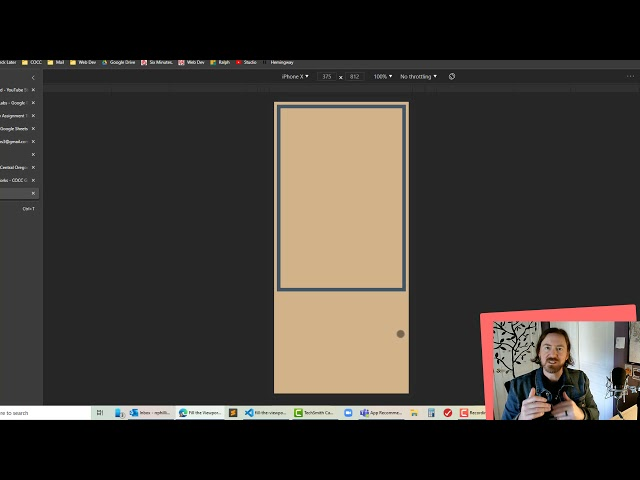</a>

---

### CSS: Text

```css
text-align: left;
text-align: right;
text-align: center;
text-align: justify;
```

> The `text-align` CSS property sets the horizontal alignment of a block element or a table-cell box.

---

```css
font-weight: normal;
font-weight: bold;
font-weight: lighter;
font-weight: bolder;
font-weight: 100;
font-weight: 900;
```

> - set a the weight (or boldness) of the font. The weights available depend on the `font-family` you are using.
> - typically `font-weight: 400; ` is normal
> - `font-weight: 700; ` is bold

---

```css
text-decoration: underline;
text-decoration: underline dotted;
text-decoration: underline dotted red;
text-decoration: green wavy underline;
text-decoration: underline overline #ff3028;
text-decoration: none;
```

> `none` can be used to remove default underline for example from `anchor` tags.

---

```css
line-height: normal;
line-height: 2.5;
line-height: 3em;
line-height: 150%;
line-height: 32px;
```

---

```css
font-size: 1.2em;
font-size: x-small;
font-size: smaller;
font-size: 12px;
font-size: 80%;
```

> avoid using font-size unit as `px` for responsive web design.

---

```css
text-transform: capitalize;
text-transform: uppercase;
text-transform: lowercase;
text-transform: none;
text-transform: full-width;
text-transform: full-size-kana;
```

---

```css
font-family: Georgia, serif;
font-family: "Gill Sans", sans-serif;
```

> - `Gill Sans` is the primary font and `sans-serif` is the fallback font.
> - A complete collection of web safe CSS font stacks and how much % of windows and Mac machines have it. [Link here](https://www.cssfontstack.com/)

---

### CSS: Selectors

```css
* {
  color: black;
}
```

> _**Universal selector**_ selects everything in the document.

---

```css
img {
  width: 100px;
  height: 200px;
}
```

> _**Element selector**_

---

```css
h1,
h2 {
  color: magenta;
}
```

> _**Selector List**_ combine multiple selectors.

---

```css
#logout {
  color: orange;
  height: 200px;
}
```

> _**ID Selector**_ select the element with id of 'logout'

---

```css
.complete {
  color: green;
}
```

> _**Class selector**_

---

```css
li a {
  color: teal;
}
```

> _**Descendant selector**_
>
> - Select all `<a>`'s that are nested or inside `<li>`. In other words, `<a> `that are descendants of `<li>`.
> - the `SPACE` is important.

---

```css
h1 + p {
  color: red;
}
```

> _**Adjacent selector**_ - the "+" sign is called a combinator.

> Select only the paragraphs that are immediately preceded by an `<h1>`.

---

```css
div > li {
  color: white;
}
```

> _**Direct Child**_

> Select only the `<li>`'s that are direct children of a `<div>` element.

---

```css
input[type="text"] {
  width: 300px;
  color: yellow;
}
```

> _**Attribute Selector**_

> Select all input elements where the `type` attribute is set to "`text`".

---

#### CSS:pseudo-class

```css
a:hover {
  color: orange;
}
```

> _**Pseudo-class :hover**_

> Selects any `<a>` element when "hovered".

---

```css
.post button:active {
  background-color: #02c39a;
}
```

> _**Pseudo-class :active**_

> Select all `buttons`(element selector) which are nested or inside(descendant combinator) of a `.post` class (class selector) which are in an `active` state (pseudo class:active)

---

```css
:checked {
  border: 1px solid blue;
}
```

> _**Pseudo-class :checked**_

> Selects any `radio`, `checkbox`, or `option` element that is checked or toggled to an `on` state

---

```css
p:nth-of-type(4n) {
  color: lime;
}
```

> _**Pseudo-class :nth-of-type()**_

> - matches elements of a given type, based on their position among a group of siblings.
> - the `nth-of-type` pseudo-class is specified with a single argument, which represents the pattern for matching elements.

---

#### CSS: Pseudo elements

```css
h2::first-letter {
  font-size: 50px;
}
```

> Keywords added to a selector that lets you select a particular part of selected element(s)

---

```css
::selection {
  background-color: cyan;
}
```

> - Applies styles to the part of a document that has been highlighted by the user (such as clicking and dragging the mouse across text)
> - Only certain CSS properties can be used with `::selection`.
>   - `color`
>   - `background-color`
>   - `cursor`
>   - `caret-color`
>   - `outline` and its longhands
>   - `text-decoration` and its associated properties
>   - `text-emphasis-color`
>   - `text-shadow`
>   - in particular, `background-image` is _**ignored**_.

---

### CSS: Specificity

> It is a measure of how specific a given selector is. The more specific selector "wins".

> **ID > CLASS > Element**

> **Example 1:**

```css
selection p {
  color: teal;
}
```

> | 0            | 0            | 2              |
> | ------------ | ------------ | -------------- |
> | ID selectors | Class,       | Element,       |
> |              | Attribute,   | Pseudo-element |
> |              | Pseudo-class |                |
>
> Total score: **2**

> **Example 2:**

```css
#submit {
  color: olive;
}
```

> | 1            | 0            | 0              |
> | ------------ | ------------ | -------------- |
> | ID selectors | Class,       | Element,       |
> |              | Attribute,   | Pseudo-element |
> |              | Pseudo-class |                |
>
> Total score: **100**

A link to an online [specificity calculator](https://specificity.keegan.st/).

---

### CSS: Box Model


---

**`Width` and `Height` properties**

```css
box-sizing: content-box;
```

> Setting up the width/height property controls the width/height for the inner content and the more padding or border you add, the more the box expands outwards to accomodate the extra padding or the border size. so in total, the end result is more bigger than the width.

> This is the `Default` behavior.

```css
box-sizing: border-box;
```

> Once the width/height of the box is set, increasing the padding or border will not push the box outward but instead push the contents of the box narrower to accomodate the extra padding inside the box. Under no circumstances the total width/height is going to exceed than what has been defined.

> `Not` the `Default` behavior.

---

**`border` properties**

| border-width           | border-color       | border-style                                  |
| ---------------------- | ------------------ | --------------------------------------------- |
| Controls the thickness | Controls the color | Controls the line style - dashed, solid, etc. |

```css
#one {
  border: 4px solid black;
}
```

> border shorthand. set all in one go.

---

```css
#one {
  border-radius: 50%;
}
```

> rounds the corners of an element's outer border edge.

---

**Padding & Margin**

Apply to all four sides

```css
padding: 10px;
```

```css
margin: 10px;
```

vertical | Horizontal

```css
padding: 5px, 10px;
```

```css
margin: 5px, 10px;
```

top | Horizontal | bottom

```css
padding: 1px 2px 2px;
```

```css
margin: 1px 2px 2px;
```

top | right | bottom | left

```css
padding: 5px 1px 0 2px;
```

```css
margin: 5px 1px 0 2px;
```

---

**Display Property**

| inline                                                             | block                                         | inline-block                                   |
| ------------------------------------------------------------------ | --------------------------------------------- | ---------------------------------------------- |
| Width & Height are ignored                                         | Block elements break the flow of a document.  | Behaved like an inline element except          |
| Width & padding push elements away horizontally but not vertically | Width, Height, Margin & Padding are respected | Width, Height, Margin & Padding are respected. |

---

**CSS Units**
|Relative|Absolute|
|---|---|
|EM|PX|
|REM|PT|
|VH|CM|
|VW|IN|
|%|MM|

> - Percentages are always relative to some other value. sometimes its a value from the parent and other times its a value from the element itself.
> - `width: 50%` - half the width of the parent
> - `line-height: 50%` - half the font-size of the element itself.

---

**em**

> `em`'s are relative units
>
> - with font size, `1em` equals the font-size of the parent. `2em`'s is twice the font-size of the parent, etc.
> - with other properties, `1em` is equal to the computed font-size of the element itself.

```css
h2 {
  font-size: 5em;
  margin-left: 1em;
}
```

> `h2`'s margin changes size changes relative to the font size of `h2`.

---

**rem**

> **problem:** Since `em`'s are based on the parents font size, in certain situations like a nested list, they get progressively smaller or larger.

> **solution -** `root em` or `rem` : relative to the `root html` element's font size.

---

### CSS : Misc. properties

**Opacity + Alpha Channel**

```css
rgba(0,209,112,0.5);
```

```css
#00cca0FF; or #00cca000;
```

> - The last channel is the `alpha` channel. It determines transparency. Values range from 0 to 1.
> - This doesnt afffect the child elements nested within it.

```css
opacity(0.3);
```

> - `opacity` is the degree to which the content behind is hidden. and is the opposite of transparency
> - It affects every element that is dependent on the current element.

---

**Position**

> `position` CSS property determines how `top, right, bottom` and `left` properties work.
>
> - `static` - the element is positioned according to the normal flow of the document. The top, right, bottom, left`and`z-index` properties have _no effect_. This is the default value.
> - `relative` - the element is positioned according to the normal flow of the document, and then offset relative to itself based on the values of `top, right, bottom`, and `left`.
> - `absolute` - the element is removed from the normal document flow and no space is created for the element in the page layout. It is positioned relative to its **closest positioned ancestor**, if any; otherwise, it is placed relative to the initial `containing block`.
> - `fixed` - the element is removed from the normal document flow, and no space is created for the element in the page layout. It is positioned relative to the initial `containing block`. This value always creates a `stacking context`. In printed documents, the element is placed in the same position on every page.
> - `sticky` - the element is positioned according to the normal flow of the document, and then offset relative to its nearest `scrolling ancestor` and `containing block`. _**Bacically it begins not fixed to the top but it scrolls along with the content until it hits the top then it stays fixed.**_

<p align="center">
  
&nbsp; &nbsp; &nbsp; &nbsp;
  
  &nbsp; &nbsp; &nbsp; &nbsp;

</p>

---

### CSS Transitions

> **Property name | Duration | Timing Function | Delay**
>
> - Transitions enable you to define the transition between two states of an element. Different states may be defined using pseudo-classes like `:hover` or `:active` or dynamically set using JavaScript.

```css
div {
  transition: <property> <duration> <timing-function> <delay>;
}
```

> - `transition-property:` sets the CSS properties to which a transition effect should be applied. List of [properties that can be animated](https://developer.mozilla.org/en-US/docs/Web/CSS/CSS_animated_properties).

```css
.target {
  font-size: 14px;
  transition-property: font-size;
  transition-duration: 4s;
}

.target:hover {
  font-size: 36px;
}
```

> - `transition-duration:` sets the length of time a trancition animation should take to complete. By default, the value is 0s.

```css
.duration-1 {
  transition-duration: 0.5s;
}
```

> - `transition-timing-function:` sets how intermediate values are calculated for CSS properties being affected by a transition effect.

```css
div:nth-of-type(1) {
  transition-timing-function: ease-in;
}
div:nth-of-type(2) {
  transition-timing-function: ease-out;
}
div:nth-of-type(3) {
  transition-timing-function: cubic-bezier(0.39, 0.575, 0.565, 1);
}
```

For pre-defined easing functions check [this link.](https://easings.net/#)

---

### CSS TRANSFORM

> The transform CSS property lets you rotate, scale, skew, or translate an element.

```css
transform: rotate(0.5turn);
transform: rotateX(10deg);
transform: rotateY(10deg);
transform: rotateZ(10deg);

transform: scale(2);
transform: scale(2, 0.5);
transform: scaleX(2);
transform: scaleY(0.5);
transform: scaleZ(0.3);

transform: translate(12opx);
transform: translate(12px, 50%);
transform: translateX(2em);
transform: translateY(3in);
transform: translateZ(2px);

transform: skew(30deg);
transform: skewX(30deg);
transform: skewY(1.07rad);
transform: skew(30deg, 20deg);

transform: translateX(10px) rotate(10deg) translateY(5px);
```

---

**Background**

```css
/* Using a <background-color> */
background: green;

/* Using a <bg-image> and <repeat-style> */
background: url("test.jpg") repeat-y;

/* Using a <box> and <background-color> */
background: border-box red;

/* A single image, centered and scaled */
background: no-repeat centre/80% url("../img/image.png");
```

> the `<bg-size>` value may _**only**_ be included immediately after `<position>`, separated with the '/' character, like this: `"center/80%".`

---

**Google Fonts**

> - Goto https://fonts.google.com/
> - select the font, embed the copied code into `<head>` using `<style>`.
> - Copy the accompanying CSS rule to specify the `font-family`.

---

### CSS: Flexbox

> The _**flex container**_ is the element that holds _**flex items**_.
> Flex items are _**direct children**_ of flex containers.

**Flex-box Properties**

| Container Properties | Flex Item Properties |
| -------------------- | -------------------- |
| flex-direction       | order                |
| justify-content      | flex-basis           |
| flex-wrap            | flex-grow            |
| align-items          | flex-shrink          |
| align-content        | align-self           |
| flex-flow            |                      |
|                      |                      |

---

**The Axes**

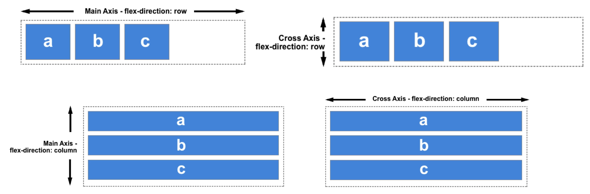

> The **direction** of the **main** and **cross axis** is dependant on whether **flex-direction** is **_row or column_**.

---

|                         | main-axis         | cross-axis    |
| ----------------------- | ----------------- | ------------- |
| **Align items on the**, | `justify-content` | `align-items` |
|                         | **M J C**         | **C A I**     |

**Justify Content**

> - Used on the flex _container_ **not** the flex _items._
> - Used to justify flex **`items`** on the **`main-axis`**.
> - `justify-content` pertains to the **main-axis**. ,
> - If we are working with `flex-direction: row `, **main-axis** is _horizontal_.
> - On the other hand if we are working with `flex-direction: column `, **main-axis** is _vertical_.

---

For the following examples, the default is `flex-direction: row`

```css
.flex-container {
  justify-content: start;
}
```

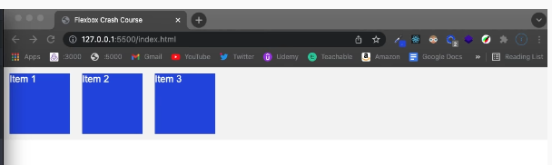

---

```css
.flex-container {
  justify-content: end;
}
```

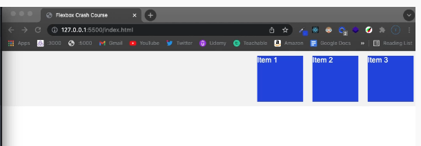

---

```css
.flex-container {
  justify-content: center;
}
```

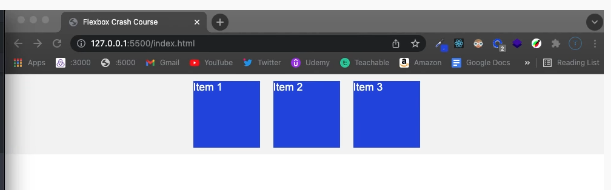

---

```css
.flex-container {
  justify-content: space-around;
}
```

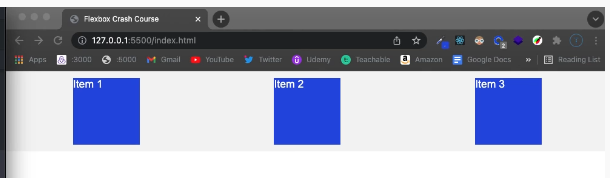

---

```css
.flex-container {
  justify-content: space-between;
}
```

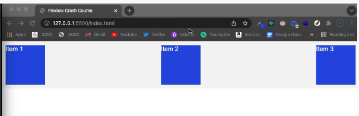

---

**Align Items**

> Used to align flex **`items`** along the **`cross axis.`**

```css
.flex-container {
  align-items: end;
}
```

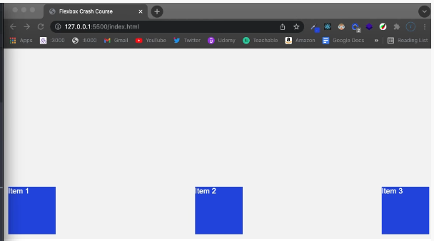

---

```css
.flex-container {
  align-items: start;
}
```


---

```css
.flex-container {
  align-items: center;
}
```

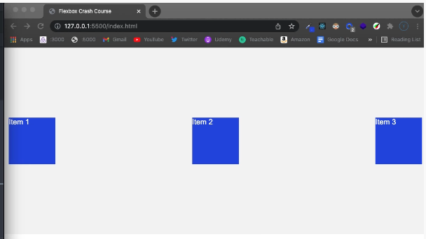

---

> **`align-self`** is helpful to individually align flex items **one by one**.

```css
.item:nth-of-type(1) {
  align-self: start;
}

.item:nth-of-type(2) {
  align-self: center;
}

.item:nth-of-type(3) {
  align-self: end;
}
```

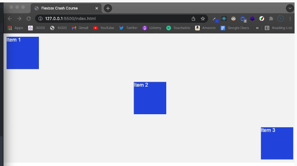

---

**flex-wrap**

> - Sets whether flex items are forced onto one line or can wrap onto multiple lines.
> - Changes the direction of the **`cross-axis`**.

```css
flex-wrap: nowrap;
```

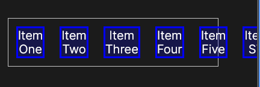

---

```css
flex-wrap: wrap;
```

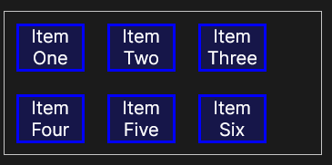

---

```css
flex-wrap: wrap-reverse;
```

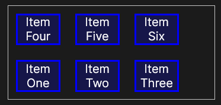

---

```css
flex-wrap: wrap;
flex-direction: row-reverse;
```

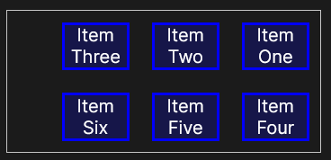

---

```css
flex-wrap: wrap-reverse;
flex-direction: row-reverse;
```

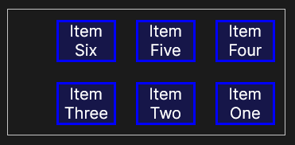

---

**Order**

> Used to manually change the _order of flex items_ in the flex container.

```css
.item:nth-of-type(1) {
  order: 2;
}

.item:nth-of-type(2) {
  order: 1;
}

.item:nth-of-type(3) {
  order: 3;
}
```

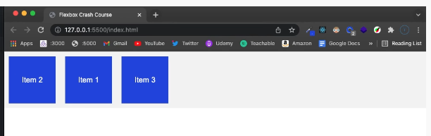

---

**flex-basis**

> - set on flex _items_.
> - The `flex-basis` property specifies the **initial length** of a flexible item.
> - **flex-basis** is along the **main-axis**.
> - **flex-basis** refers to _width_ or _height_ depensing on the **flex-row or column** respectively.

```css
.item:nth-of-type(1) {
  flex-basis: 200px;
}
```

---

**flex-grow**

> - Specifies how much of the remaining space in the flex container should be assigned to the item (the flex grow factor).
> - If all sibling items have the same flex grow factor, then all items will receive the same share of remaining space, otherwise it is distributed according to the ratio defined by the different flex grow factors.

```css
.item:nth-of-type(1) {
  flex-grow: 1;
}

.item:nth-of-type(2) {
  flex-grow: 2;
}

.item:nth-of-type(3) {
  flex-grow: 1;
}
```

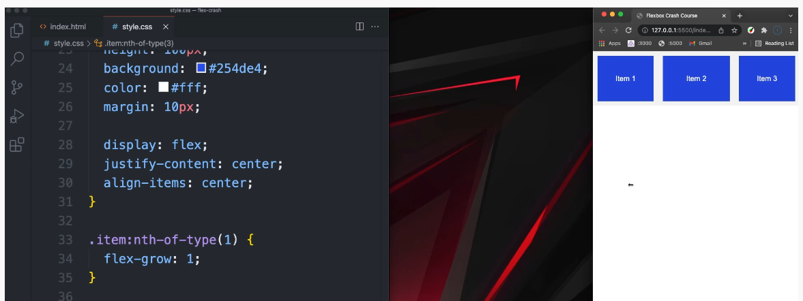
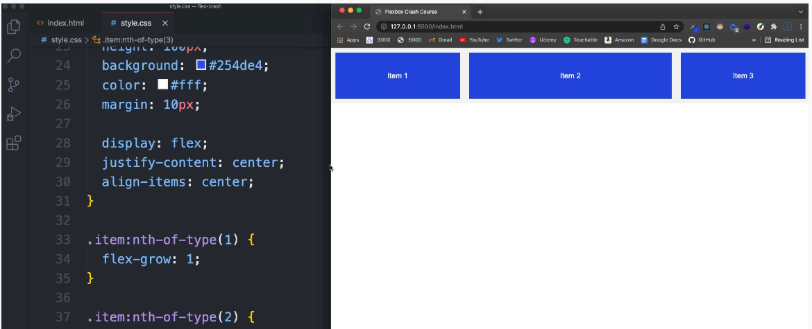
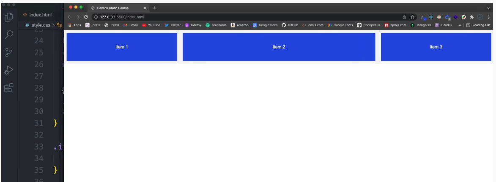

---

**flex-shrink**

> Specifies how the item will shrink relative to the rest of the flexible items inside the same container.

```css
.item:nth-of-type(1) {
  flex-shrink: 1;
}
```

---

**flex = flex grow + flex shrink + flex basis**

```css
.item:nth-of-type(1) {
  flex: 1 0 100px;
}
```

```css
.item:nth-of-type(1) {
  flex: 1;
}
```

---

### Media Queries

> - to modify your site or app depending on a device's general type (such as print vs. screen) or specific characteristics and parameters (such as screen resolution or browser viewport width).

```css
@media (min-width: 800px) and (max-width: 1200px) {
  body {
    background-color: darksalmon;
  }
}

@media (orientation: landscape) {
  h1 {
    color: white;
  }
}
```

### CSS Reset

[**Github link to CSS reset**](https://github.com/elad2412/the-new-css-reset)

[Latest link to download the file](https://raw.githubusercontent.com/elad2412/the-new-css-reset/main/css/reset.css)

---

### CSS Bootstrap

https://getbootstrap.com/
